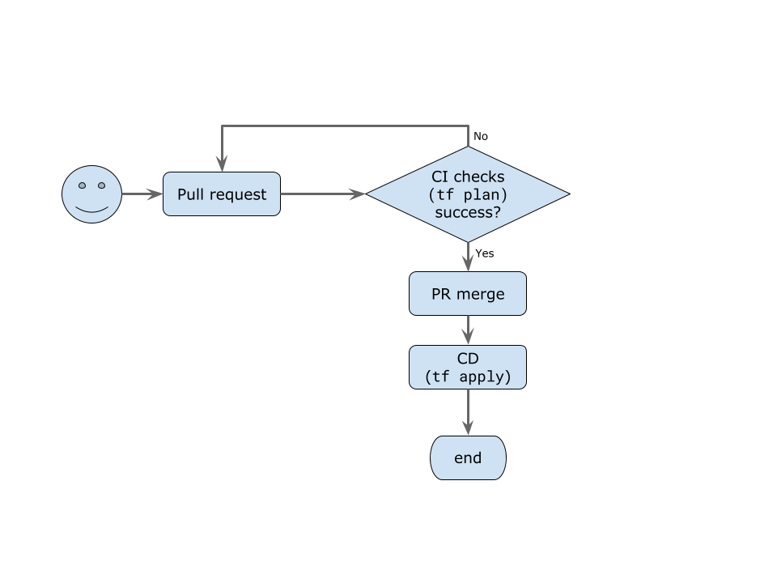

.. image:: https://readthedocs.org/projects/{{ cookiecutter.org_slug }}-github-control/badge/?version=latest
    :target: https://{{ cookiecutter.org_slug }}-github-control.readthedocs.io/en/latest/?badge=latest
    :alt: Documentation Status

GitHub Control
==============
The "{{ cookiecutter.org_name }}GitHub Control" repository manages
the `{{ cookiecutter.org_name }} <https://github.com/{{ cookiecutter.org_slug }}>`_ GitHub organization.
The repository uses `GitHub Terraform provider <https://registry.terraform.io/providers/integrations/github/latest/docs>`_
to define organization settings, repositories, and everything else supported by the provider.
It is the configuration source of truth.
If anything needs to be changed, including adding a new repository, the change should be made in this repository.
Changes made outside of the repository may be reverted.
Continuous Integration and Deployment (CI/CD) is configured for this repository.

Workflow
--------

When a user wants to make a change in {{ cookiecutter.org_name }} GitHub configuration they should submit a pull request into the ``main`` branch.
Once the pull request is created, GitHub Actions worker will run a set of checks.
The checks include executing ``terraform plan``, linter, and other tests that are included now or will be included in future.
A failed check will block the pull request from merging.

Once the pull request is merged, GitHub Actions runs ``terraform apply`` to implement new changes.

    Repository workflow.

Input secrets
-------------
The repo needs a set of inputs available for in the pull request stage as well as for deployment.

Secrets
~~~~~~~
Defined in https://github.com/{{ cookiecutter.org_slug }}/github-control/settings/secrets/actions.

``AWS_ACCESS_KEY_ID``, ``AWS_SECRET_ACCESS_KEY``, ``AWS_DEFAULT_REGION``
    AWS credentials of a user that has privileges to work with a Terraform state in S3.
    Minimal privileges required [#]_:

    * ``ListBucket``
    * ``GetObject``
    * ``PutObject``
    * ``DeleteObject``

``GH_TOKEN``
    Personal token of a user `{{ cookiecutter.org_slug }} <https://github.com/{{ cookiecutter.org_slug }}>`_.
    Created in https://github.com/settings/tokens.

.. [#] The repository doesn't use Terraform state locking at the moment.
    If it did, additional privileges would be needed to work with a DynamoDB table.
